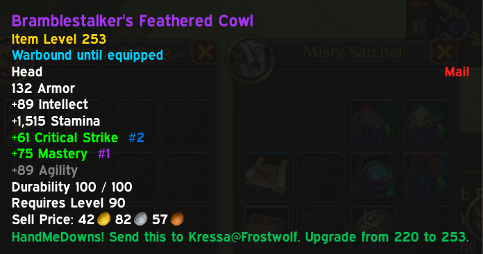

# WarbandMeDowns

[)](https://github.com/sgade/WarbandMeDowns/releases)  [)](https://www.curseforge.com/wow/addons/mountsrarity)

Recommends alt characters for warbound and bind-on-equip gear.

WarbandMeDowns computes, for the whole warband, which character should end up with which warbound item. Every character's equipped gear, bags, bank, and mailbox are scanned together, so a spare sitting unlooked-at in one alt's bag can cascade down to a lower-priority alt instead of being invisible to the recommendation.

Characters are ranked in priority order by current level first, then equipped average item level, and walked in that order for each equipment slot; each eligible character gets the better of their own current gear and the best still-unclaimed candidate for that slot.
If the current character ends up with the hovered item, the tooltip recommends keeping it; if a different character does, it recommends sending it there; if nobody in the warband ends up wanting it, it recommends selling it.

Required character level on an item is intentionally not checked, so gear can be sent to an alt for later leveling.

When two items share the exact same item level, the tie is broken by secondary stats - _but only if Pawn is installed_.
WarbandMeDowns doesn't keep its own stat preference data; it asks Pawn to score both items against the character's spec and recommends whichever one Pawn values higher.

Armor, shields, and weapons are checked against class-compatible item subclasses. One-handed weapons are compared against both main-hand and off-hand slots when the item can go in either hand. Weapon comparisons only consider the same weapon subclass, so a character's better sword does not block a dagger recommendation.

## Dependencies

**Note**: If you have [Altoholic](https://www.curseforge.com/wow/addons/altoholic) installed, DataStore is already installed for you.

- [DataStore](https://www.curseforge.com/wow/addons/datastore)
- [DataStore_Characters](https://www.curseforge.com/wow/addons/datastore_characters)
- [DataStore_Inventory](https://www.curseforge.com/wow/addons/datastore_inventory)
- [DataStore_Containers](https://www.curseforge.com/wow/addons/datastore_containers)
- [DataStore_Mails](https://www.curseforge.com/wow/addons/datastore_mail)

## Optional dependencies

- [DataStore_Talents](https://www.curseforge.com/wow/addons/datastore_talents)
- [Pawn](https://www.curseforge.com/wow/addons/pawn)

## Refreshing data sources

See [DATA_SOURCES.md](docs/DATA_SOURCES.md) for information on how to refresh the information by external sources.

## Issues

If you find any issues with this project, feel free to raise them [here](https://github.com/sgade/WarbandMeDowns/issues).
